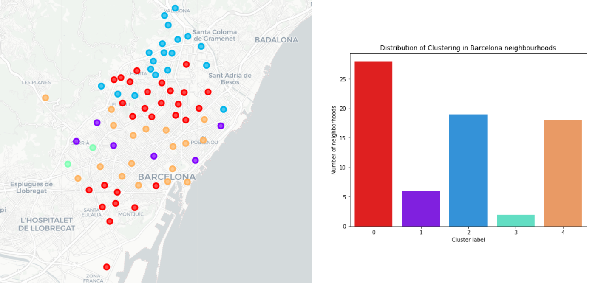

# The quest for the perfect Neighborhood

This is the final project of the IBM Data Science Professional Certificate.

## Project overview

Barcelona is a modern cosmopolitan city endowed with great dynamism. A great place with a rich culture, an identity of its own and an inexhaustible cultural and recreational offer. The city is divided in 10 districts and 73 neighborhoods. The business idea was to develop an application that could indicate which is the ideal neighborhood for a person according to their needs and personality. In this project, a machine learning model was created using a **k-means clustering algorithm** to divide Barcelona into 5 differents zones based on the coordinates of each neighborhood, their most interesting sites, cost of the average rental of apartments, public libraries and transport information. 

As part of the project, a [Business approach](https://github.com/HannaLAguilar/The_Battle_of_the_neighborhoods-Barcelona/blob/master/Business%20approach.md) was developed.

 

### Technologies used in this project:
* Python
* pandas, numpy
* sklearn, cluster k-means
* matplotlib, seaborn, folium
* jupyter notebooks, anaconda

## Data

The sources used for this project were:

- **Foursquare**, to get the venue data from the neighborhoods
- **[Open Data BCN](https://opendata-ajuntament.barcelona.cat/es/)**, to get information about:
    - Population
    - Coordinates of the neighborhoods
    - Apartment rental by neighborhood 
    - Public libraries 
    - Public transportation
    
The csv files are located in the cvs folder.

## Summary of results

The final distribution of the cluster can be seen in the following image:

 

The mean of the rental of the clusters 0 and 2 (the ones with more neighborhoods) was 720€. 
 
The final presentation of the project is shown [here](https://github.com/HannaLAguilar/Clustering_neighborhoods-Barcelona/blob/master/Presentation_BCN_clustering_neigh.pdf).

## Installation

Using [Anaconda](https://www.anaconda.com/products/individual), in an enviroment with python 3, install the following packages:
```
conda install jupyter, numpy, pandas=0.25, matplotlib, seaborn
conda install -c anaconda scikit-learn
conda install -c conda-forge folium
```
Then, run the [Project Code](https://github.com/HannaLAguilar/Clustering_neighborhoods-Barcelona/blob/master/Project%20Code.ipynb)

