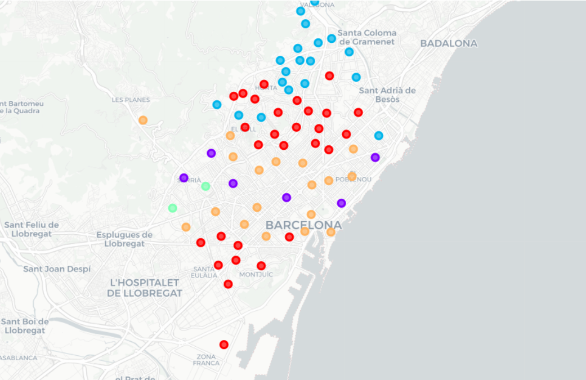

# The quest for the perfect Neighbourhood

This is the final project of the IBM Data Science Professional Certificate.

## Project overview

Using a combination of coordinates of the neighborhoods, location date like restaurants, cinemas, clubs, and Machine Learning, I grouped neighborhoods into 5 cluster like the image. 

#### Technologies used in this project:
* Python
* pandas, numpy
* sklearn, cluster kmeans
* matplotlib, seaborn, folium
* jupyter notebooks, anaconda

## Data

The sources used for this project are Foursquare and [Open Data BCN](https://opendata-ajuntament.barcelona.cat/es/).

## Summary of results

 

Check:

* [Project Code](https://github.com/HannaLAguilar/The-Battle-of-the-neighborhoods-Barcelona/blob/master/Project%20Code.ipynb)
* [Final presentation](https://github.com/HannaLAguilar/The-Battle-of-the-neighborhoods-Barcelona/blob/master/Presentation_HLA.pdf)

